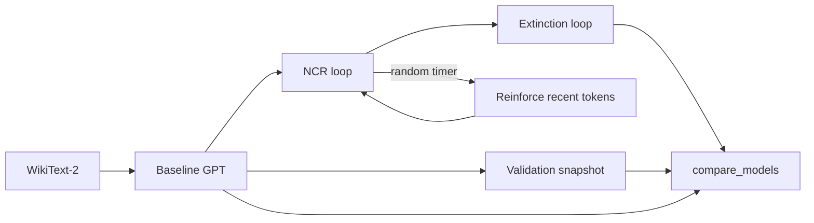

# Non-Contingent Reinforcement (NCR) — Skinner × LLM

Recreate B.F. Skinner’s *Superstition in the Pigeon* with a small GPT: **rewards arrive on a random time schedule, not because of what the model did.**

The model keeps “behaving” (generating one token per second). When the random timer fires, we strengthen whatever it was doing at that moment via short fine-tuning on its recent token window — analogous to food pellets arriving while the pigeon happens to be turning in a circle.

## Recommended datasets (free, open)

| Dataset | HF id | Best for | Notes |
|--------|--------|----------|-------|
| **WikiText-2** (default) | `wikitext/wikitext-2-raw-v1` | Balanced vocabulary + local training | ~2M tokens; good “knows English but still plastic” baseline |
| **TinyStories** | `roneneldan/TinyStories` | Fast iteration / weaker baseline | Simple sentences; superstition may be easier to see but less like “adult English” |
| **OpenWebText** (subset) | `openwebtext` | Richer vocabulary | Needs more disk/GPU; prepare a 1–5% shard if WikiText feels too small |
| **Gutenberg** (subset) | `sedthh/gutenberg_en` | Literary English | Good if you want stable prose patterns |

**Recommendation:** start with **WikiText-2**. If baseline training is too slow to reach your loss target, try **TinyStories** for debugging the pipeline, then return to WikiText.

## Parameter choices `(i)` — starting recommendations

Edit `config/default.yaml` as you learn. Suggested first run on a MacBook (MPS) or a single GPU:

| Parameter | Default | Rationale |
|-----------|---------|-----------|
| `baseline.target_val_loss` | **3.4** | WikiText-2 on a ~10M-param GPT: fluent enough to read, not GPT-2-level (loss ~3.0 is harder to budge) |
| `baseline.max_iters` | **5000** | ~30–60 min on MPS; increase to 8000 if you don’t hit readiness |
| `ncr.min_interval_sec` / `max_interval_sec` | **1 / 30** | Matches your spec; avg ~15.5s between reinforcements |
| `ncr.duration_hours` | **2** | Pilot length; Skinner ran long sessions — use **4–8h** overnight once the pipeline works |
| `ncr.reinforce_window_tokens` | **64** | “Current ritual” length; try **32** (more local) or **128** (stronger superstition) |
| `ncr.reinforce_steps` | **3** | Small positive “pellets”; raise to 5 if behavior barely shifts |
| `extinction.duration_hours` | **0.5** | Quick check; use **1–2h** for stronger extinction tests |

**Readiness rule:** when `val_loss <= target_val_loss`, `train_baseline.py` writes `checkpoints/baseline_ready.pt` and `checkpoints/readiness.json`.

## Scripts (run in order)

```bash
cd "/Users/roger/Documents/Obsidian Vault/Projects/non-contingent reinforcement"
python3 -m venv .venv
source .venv/bin/activate
pip install -r requirements.txt

# 0) Data
python scripts/prepare_data.py --dataset wikitext2

# 1) Baseline training
python scripts/train_baseline.py

# 1b) Pre-experiment validation corpus (for drift metrics)
python scripts/collect_validation.py

# 2) NCR experiment (random reinforcement)
python scripts/run_ncr.py

# 3) Extinction (no reinforcement)
python scripts/run_extinction.py

# 4) Compare + export analysis
python scripts/compare_models.py
```

### Outputs you’ll analyze

| Path | Contents |
|------|----------|
| `runs/baseline_train.jsonl` | Training loss curve |
| `runs/ncr/ncr_events.jsonl` | Each random reinforcement + behavior window |
| `runs/ncr/behavior_trace.jsonl` | Token stream during NCR |
| `runs/extinction/behavior_trace.jsonl` | Token stream without rewards |
| `analysis/validation_snapshot.json` | Pre-experiment generations |
| `analysis/summary.csv` | Val loss per stage + deltas |
| `analysis/report.json` | Full report + regenerated previews + bigram habits |

## Architecture (short)



## Design notes

- **Non-contingent:** the reinforcement timer does not look at loss, perplexity, or human ratings — only wall-clock randomness.
- **Why fine-tune on recent tokens?** Skinner’s reinforcer strengthened whatever response class was occurring. Maximizing log-likelihood of the current window is the closest analogue for autoregressive LMs.
- **Copies of the model:** each phase loads from a checkpoint and saves a new one (`baseline_ready` → `after_ncr` → `after_extinction`). To run parallel subjects, copy `baseline_ready.pt` to `checkpoints/subject_01.pt` and pass `--checkpoint`.

## Next steps to tune with me

1. Run a **short** NCR (`duration_hours: 0.1`) to verify logs and behavior traces.
2. Inspect `runs/ncr/behavior_trace.jsonl` for repeating n-grams (rituals).
3. Adjust `target_val_loss` (higher = weaker baseline = easier superstition; lower = more “competent” English).
4. Scale `duration_hours` once the pilot looks right.
